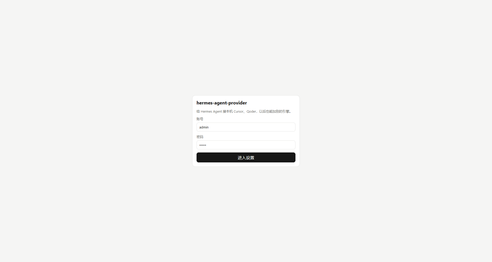
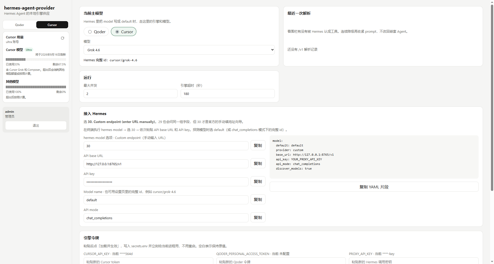

# hermes-agent-provider

[中文](README.md) | **English**

A local provider that lets [Hermes Agent](https://hermes-agent.nousresearch.com/) use engines already signed in on your machine.

**Cursor** and **Qoder** ship today; more engines can be added later. You do not need an OpenAI or other cloud LLM key. Tokens come from the Cursor / Qoder account you already pay for.

Hermes talks to this repo as a **custom provider**. The wire format is the Chat Completions facade Hermes asks for (`/v1/models`, `/v1/chat/completions`). This is **not** the official OpenAI API. The lower layer is each engine’s own SDK.





## Get running in 5 minutes

Finish these 6 steps in order. After that, Hermes can chat through your local Cursor / Qoder account.

### 1. Prerequisites

- Python 3.11+
- Node.js 18+ (for the settings UI)
- **Cursor** or **Qoder** already signed in on this machine (or paste a token later)
- [Hermes Agent](https://hermes-agent.nousresearch.com/) installed

### 2. Clone

```bash
git clone git@github.com:hjcenry/hermes-agent-provider.git
cd hermes-agent-provider
```

### 3. Start

The first launch script will:

1. Copy `config/secrets.env.example` → `config/secrets.env`
2. Copy `config/local.yaml.example` → `config/local.yaml`
3. Create `backend/.venv` and install Python deps
4. Run `npm install` when needed
5. Start the API and the settings UI

**Windows** (double-click or run in a terminal):

```text
scripts\windows\start-all.bat
```

Or two windows:

```text
scripts\windows\start-backend.bat
scripts\windows\start-frontend.bat
```

**macOS:**

```bash
chmod +x scripts/mac/*.sh
scripts/mac/start-all.sh
```

Or separately:

```bash
scripts/mac/start-backend.sh
scripts/mac/start-frontend.sh
```

When it is up:

| URL | What it is |
|-----|------------|
| http://127.0.0.1:8765/healthz | Backend health check |
| http://127.0.0.1:8765/v1 | Base URL you paste into Hermes |
| http://127.0.0.1:5176 | Settings UI (login + home) |

It binds `127.0.0.1` only. Do not add `--reload` to uvicorn. After Python changes, close the window and start again.

### 4. Edit config (required)

Open the generated `config/secrets.env` and change at least these three:

```env
PROXY_API_KEY=a-long-random-string
SETTINGS_PASSWORD=your-settings-ui-password
SESSION_SECRET=another-long-random-string
```

| Variable | Role | How to fill it |
|----------|------|----------------|
| `PROXY_API_KEY` | Bearer token for Hermes → `/v1` | **Change it.** Paste the same value into Hermes as the API key |
| `SETTINGS_PASSWORD` | Settings UI password; username is always `admin` | Change it. The example default is `admin` |
| `SESSION_SECRET` | Cookie signing secret | Change it to any long random string |
| `CURSOR_API_KEY` | Cursor account token | Optional if the Cursor SDK is already logged in |
| `QODER_PERSONAL_ACCESS_TOKEN` | Qoder account token | Optional if `qodercli` is already logged in |

You can leave `config/local.yaml` alone at first. Defaults live in `config/default.yaml` (currently Qoder / `qmodel_38max`). After start, you can switch engine and model on the settings page.

Merge order, later wins:

`config/default.yaml` ← `config/local.yaml` ← `config/secrets.env`

`secrets.env` and `local.yaml` are gitignored. **Do not commit them.**

After you change `PROXY_API_KEY` or an engine token, click **Load and apply** on the settings page. No backend restart.

### 5. Open the settings page

Open [http://127.0.0.1:5176](http://127.0.0.1:5176):

1. On the login page, user `admin`, password = `SETTINGS_PASSWORD`.
2. On the home page, check Cursor / Qoder quota on the left. Readable quota, or a clear “not signed in” reason, both count as working.
3. If an engine is not signed in: paste a token under Engine tokens and load, or sign in locally and refresh.
4. Pick the current engine and model in the middle, then save. Hermes `model: default` follows this pair.

### 6. Point Hermes at this provider

The **Connect Hermes** card already has copyable fields. Run `hermes model`, choose **30. Custom endpoint (enter URL manually)**, and paste:

| Field | Value |
|-------|--------|
| URL | `http://127.0.0.1:8765/v1` |
| API key | Same as `PROXY_API_KEY` |
| Model | `default` (uses the settings-page engine; or `cursor/grok-4.6`, `qoder/qmodel_38max`) |
| API compatibility | **2 Chat Completions** (`api_mode: chat_completions`) |

Or write `~/.hermes/config.yaml`:

```yaml
model:
  default: default
  provider: custom
  base_url: http://127.0.0.1:8765/v1
  api_key: same-as-PROXY_API_KEY
  api_mode: chat_completions
  discover_models: true
```

Send a short chat. To switch engines, change the settings page and keep `model: default`, or `/model cursor/grok-4.6`.

Do not point vision / summarizer helper models at this service. Recaps would burn another engine turn.

## What it does

| Role | Job |
|------|-----|
| Hermes Agent | Orchestrates chat, skills, memory, MCP, and runs `tool_calls` |
| This repo | Translates one completion into one engine call, then back into a Hermes-shaped response |
| Cursor / Qoder | Inference only. This service turns off their file/edit tools |

In one line: Hermes is the conductor; the local engine is the brain.

## Behavior

- Engine tools are all off in this phase so they do not fight Hermes for files.
- Engine sessions are not resumed. History lives only in Hermes `messages`.
- With `stream=true` the proxy collects the full engine output, then replays SSE. It must see the whole text to decide “plain reply” vs Hermes `tool_calls`. Enabling display streaming in Hermes does not speed up the first token.
- Slow small talk: pick a faster engine model, or lower Hermes `reasoning_effort`.
- The settings page **Last parse** card counts fence-ok / plain text / degraded, so you can see whether memory or skills were recognized as tools.
- `/v1` uses Bearer; the settings UI uses a cookie.

For a single-process deploy: `cd frontend && npm run build`. The backend then serves the static files at `/`.

## Tests

```text
cd backend
python -m venv .venv
.venv\Scripts\pip install -r requirements.txt
.venv\Scripts\python -m pytest -q
```

On macOS / Linux, use `.venv/bin/pip` and `.venv/bin/python`.

Tests do not call paid cloud APIs. A local fake engine is available via `HERMES_AGENT_PROVIDER_FAKE`.

Design notes: [docs/superpowers/specs/2026-09-16-hermes-proxy-design.md](docs/superpowers/specs/2026-09-16-hermes-proxy-design.md)

## Security

- It does not listen on `0.0.0.0` by default. Anyone who has `PROXY_API_KEY` can spend your Cursor / Qoder quota.
- `config/secrets.env` is gitignored. Do not commit it.
- This service does not execute Hermes tools. Command confirmation and memory writes stay under Hermes’ own policy.
