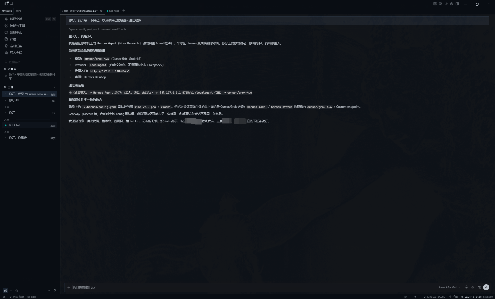

# hermes-agent-provider

**中文** | [English](README.en.md)

给 [Hermes Agent](https://hermes-agent.nousresearch.com/) 接本机引擎的本地供应器。

现在内置 **Cursor**、**Qoder**，以后还能加别的引擎。不需要 OpenAI 或其他云厂商的 LLM Key：脑力来自你已经登录的 Cursor / Qoder 账号额度。

Hermes 把它当成 **custom provider**。接线协议是 Hermes 要求的 Chat Completions 门面（`/v1/models`、`/v1/chat/completions`），**不是** OpenAI 官方服务，下层也不是 OpenAI，而是各引擎自己的 SDK。


Hermes 接上之后（这里是 `cursor/grok-4.6`，入口 `http://127.0.0.1:8765/v1`）：



## 5 分钟上手

按顺序做完这 6 步，就能在 Hermes 里用本机 Cursor / Qoder 对话。

### 1. 准备环境

- Python 3.11+
- Node.js 18+（跑设置页时需要）
- 本机已登录 **Cursor** 或 **Qoder**（也可稍后在设置页粘贴 token）
- 已安装 [Hermes Agent](https://hermes-agent.nousresearch.com/)

### 2. 下载代码

```bash
git clone git@github.com:hjcenry/hermes-agent-provider.git
cd hermes-agent-provider
```

### 3. 启动

首次启动脚本会自动：

1. 把 `config/secrets.env.example` 复制为 `config/secrets.env`
2. 把 `config/local.yaml.example` 复制为 `config/local.yaml`
3. 创建 `backend/.venv` 并安装依赖
4. 需要时执行 `npm install`
5. 拉起后端和设置页

**Windows**（双击或在终端运行）：

```text
scripts\windows\start-all.bat
```

也可以分开开两个窗口：

```text
scripts\windows\start-backend.bat
scripts\windows\start-frontend.bat
```

**macOS：**

```bash
chmod +x scripts/mac/*.sh
scripts/mac/start-all.sh
```

也可以分开开：

```bash
scripts/mac/start-backend.sh
scripts/mac/start-frontend.sh
```

启动成功后：

| 地址 | 用途 |
|------|------|
| http://127.0.0.1:8765/healthz | 后端探活 |
| http://127.0.0.1:8765/v1 | Hermes 要填的 API 地址 |
| http://127.0.0.1:5176 | 设置页（登录页 / 主页） |

只监听 `127.0.0.1`。不要给 uvicorn 加 `--reload`，改 Python 后关掉窗口再开。

### 4. 改配置（必须）

用编辑器打开刚生成的 `config/secrets.env`，至少改这三项：

```env
PROXY_API_KEY=请换成一段足够长的随机串
SETTINGS_PASSWORD=设置页登录密码
SESSION_SECRET=请换成另一段随机串
```

| 变量 | 干什么 | 怎么填 |
|------|--------|--------|
| `PROXY_API_KEY` | Hermes 调用 `/v1` 时的 Bearer | **必改**。之后原样填进 Hermes 的 API key |
| `SETTINGS_PASSWORD` | 设置页密码，账号固定为 `admin` | 必改。默认示例是 `admin` |
| `SESSION_SECRET` | 设置页 Cookie 签名 | 必改，随便一长串即可 |
| `CURSOR_API_KEY` | Cursor 账号 token | 可选。本机 Cursor 已登录可留空 |
| `QODER_PERSONAL_ACCESS_TOKEN` | Qoder 账号 token | 可选。本机 `qodercli` 已登录可留空 |

`config/local.yaml` 一般不用先改。默认引擎和模型在 `config/default.yaml` 里（当前是 Qoder / `qmodel_38max`），启动后也可以在设置页切换。

三层合并，后者覆盖前者：

`config/default.yaml` ← `config/local.yaml` ← `config/secrets.env`

`secrets.env` 和 `local.yaml` 已在 `.gitignore` 里，**不要提交**。

改完 `PROXY_API_KEY` / 引擎 token 后，到设置页点「加载并生效」即可，不必重启后端。

### 5. 打开设置页

浏览器打开 [http://127.0.0.1:5176](http://127.0.0.1:5176)：

1. 登录页账号 `admin`，密码填你在 `SETTINGS_PASSWORD` 里写的值。
2. 主页左侧看 Cursor / Qoder 额度。能读到额度，或能看到明确的未登录原因，都算正常。
3. 没登录引擎时：在「引擎令牌」里粘贴 token，点加载；或先在本机登录 Cursor / Qoder 再点刷新。
4. 中间选当前引擎和模型，保存。Hermes 里继续用 `model: default` 就会走这里选的组合。

### 6. 接到 Hermes

设置页「接入 Hermes」已经填好可复制字段。终端执行 `hermes model`，选 **30. Custom endpoint (enter URL manually)**，粘贴：

| 字段 | 值 |
|------|----|
| URL | `http://127.0.0.1:8765/v1` |
| API key | 与 `PROXY_API_KEY` 相同 |
| Model | `default`（走设置页当前引擎；也可写 `cursor/grok-4.6`、`qoder/qmodel_38max`） |
| API 兼容模式 | **2 Chat Completions**（`api_mode: chat_completions`） |

或写入 `~/.hermes/config.yaml`：

```yaml
model:
  default: default
  provider: custom
  base_url: http://127.0.0.1:8765/v1
  api_key: 与 PROXY_API_KEY 相同
  api_mode: chat_completions
  discover_models: true
```

发一句闲聊。接上后 Hermes 会话里会显示 Provider: `localagent`、入口为本服务 `/v1`，如上图。

换引擎：改设置页后 Hermes 继续用 `model: default`，或 `/model cursor/grok-4.6`。

不要把 vision / summarizer 等辅助模型指到本服务，回顾会再烧一轮引擎额度。

## 它做什么

| 角色 | 职责 |
|------|------|
| Hermes Agent | 编排对话、技能、记忆、MCP，执行 `tool_calls` |
| 本仓库 | 把一轮补全翻译成一次引擎调用，再译回 Hermes 能认的回包 |
| Cursor / Qoder | 只当推理引擎。本服务会关掉它们自己的读文件、改代码等工具 |

一句话：Hermes 当主编排，本机引擎当脑。

## 行为说明

- 引擎工具第一期全关，避免和 Hermes 抢着改文件。
- 不 resume 引擎会话；历史只走 Hermes 的 `messages`。
- `stream=true` 时先收齐引擎输出，再重放 SSE。必须先看完整文本才能判断是普通回复还是 Hermes `tool_calls`。Hermes 里打开展示流式，不会加快首字。
- 闲聊觉得慢：换更快的引擎模型，或降低 Hermes 的 `reasoning_effort`。
- 设置页「最近一次解析」统计围栏成功 / 纯文本 / 降级，方便看记忆、技能有没有被认成工具。
- `/v1` 用 Bearer，设置页用 Cookie。

生产可 `cd frontend && npm run build`，静态文件由后端挂在 `/`。

## 测试

```text
cd backend
python -m venv .venv
.venv\Scripts\pip install -r requirements.txt
.venv\Scripts\python -m pytest -q
```

不测真实云端扣费。本地假引擎可用环境变量 `HERMES_AGENT_PROVIDER_FAKE`。

设计文档：[docs/superpowers/specs/2026-09-16-hermes-proxy-design.md](docs/superpowers/specs/2026-09-16-hermes-proxy-design.md)

## 安全

- 默认不监听 `0.0.0.0`。谁拿到 `PROXY_API_KEY`，谁就能消耗你的 Cursor / Qoder 额度。
- `config/secrets.env` 已在 `.gitignore` 中，请勿提交。
- 本服务不执行 Hermes 的工具；命令确认、记忆写入仍由 Hermes 自己的策略负责。
